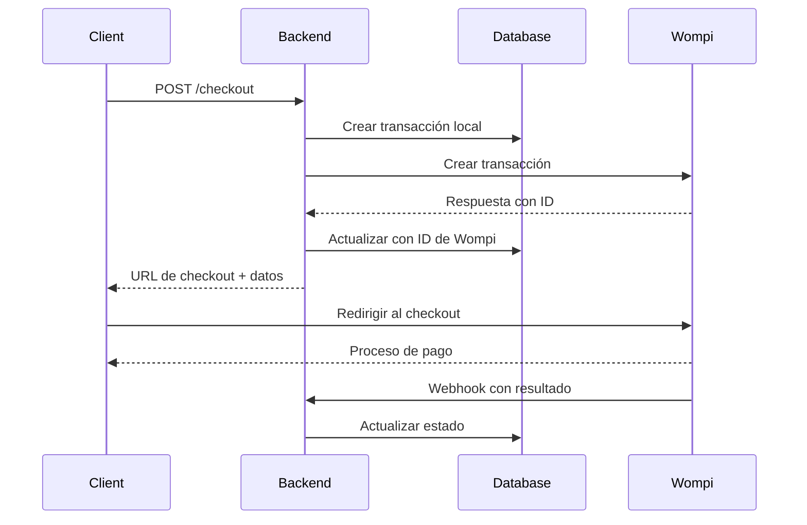

# 🛒 Sistema de Checkout con Wompi - HatsuSound

Este documento explica cómo configurar y usar el sistema de checkout integrado con Wompi para procesar pagos en la plataforma HatsuSound.

## 📋 Tabla de Contenidos

- [Configuración](#configuración)
- [Flujo de Checkout](#flujo-de-checkout)
- [Endpoints de la API](#endpoints-de-la-api)
- [Ejemplos de Uso](#ejemplos-de-uso)
- [Webhooks](#webhooks)
- [Manejo de Errores](#manejo-de-errores)
- [Testing](#testing)
- [Troubleshooting](#troubleshooting)

## ⚙️ Configuración

### 1. Variables de Entorno

Configura las siguientes variables en tu archivo `.env`:

```bash
# Entorno de Wompi (recomendado: uat_sandbox para desarrollo)
WOMPI_ENVIRONMENT=uat_sandbox

# Claves de Wompi (obtener desde https://dashboard.wompi.co/)
WOMPI_PUBLIC_KEY=pub_stagtest_xxxxxxxxxxxxxxxxxxxxxxxxxxxxxxxx
WOMPI_PRIVATE_KEY=prv_stagtest_xxxxxxxxxxxxxxxxxxxxxxxxxxxxxxxx
WOMPI_EVENTS_KEY=stagtest_events_xxxxxxxxxxxxxxxxxxxxxxxxxxxxxxxx
WOMPI_INTEGRITY_KEY=stagtest_integrity_xxxxxxxxxxxxxxxxxxxxxxxxxxxxxxxx

# URL del frontend para redirecciones
FRONTEND_URL=http://localhost:3000
```

### 2. Obtener Claves de Wompi

1. Ve a [https://dashboard.wompi.co/](https://dashboard.wompi.co/)
2. Crea una cuenta o inicia sesión
3. Ve a **Configuración > API Keys**
4. Copia las claves correspondientes a tu entorno
5. **IMPORTANTE**: `WOMPI_PUBLIC_KEY` debe ser el **MERCHANT ID**, no la public key de integración

### 3. Validar Configuración

Ejecuta el comando de validación:

```bash
npm run wompi:validate
```

Deberías ver algo como:

```
🔧 Validando configuración de Wompi...

📋 Configuración actual:
   Environment: uat_sandbox
   Base URL:    https://api-sandbox.co.uat.wompi.dev/v1
   Public Key:  pub_stagtest_...mOt7
   Private Key: prv_stagtest_...qFWg
   Events Key:  stagtest_events_…
   Integrity:   stagtest_integrity_…

🧪 1) GET /merchants/:public_key para obtener presigned acceptance... 

   ✅ OK
      Comercio: Alejandra Pruebas Sandbox UAT
      Email:    pruebasensandbox@yopmail.com
      Acceptance token: ✅
      Personal data auth: ✅

✅ Configuración Wompi verificada. Usa esos tokens en la creación de transacciones/fuentes.
```

## 🔄 Flujo de Checkout

### 1. Crear Checkout



### 2. Estados de Transacción

- **PENDING**: Transacción creada, esperando pago
- **APPROVED**: Pago exitoso
- **DECLINED**: Pago rechazado
- **ERROR**: Error en el proceso
- **EXPIRED**: Transacción expirada

## 🌐 Endpoints de la API

### POST /checkout

Crea una nueva sesión de checkout.

**Headers requeridos:**
```
Authorization: Bearer <JWT_TOKEN>
Content-Type: application/json
```

**Body de ejemplo:**
```json
{
  "amount": 50000,
  "currency": "COP",
  "customerEmail": "customer@example.com",
  "customerName": "Juan Pérez",
  "customerPhone": "+573001234567",
  "productId": "album_001",
  "productName": "HatsuSound Vol. 1",
  "productCategory": "Música",
  "productArtist": "HatsuSound Collective",
  "productGenre": "Electronic",
  "productFormat": "Digital",
  "description": "Compra de álbum HatsuSound Vol. 1",
  "metadata": {
    "releaseDate": "2025-01-15",
    "trackCount": 12,
    "duration": "45:30"
  },
  "reference": "ALBUM-001-2025"
}
```

**Respuesta exitosa:**
```json
{
  "success": true,
  "transaction": {
    "id": "txn_123456789",
    "reference": "ALBUM-001-2025",
    "amount": 50000,
    "currency": "COP",
    "status": "pending",
    "customerEmail": "customer@example.com",
    "created_at": "2025-08-19T04:47:08.641Z"
  },
  "checkoutUrl": "https://checkout.wompi.co/p/merchant_id?transaction_id=txn_123456789",
  "wompiTransactionId": "txn_123456789",
  "amount": 50000,
  "currency": "COP",
  "reference": "ALBUM-001-2025"
}
```

### GET /checkout/status/:transactionId

Obtiene el estado de una transacción por ID o referencia.

### GET /checkout/wompi/status/:wompiTransactionId

Obtiene el estado directamente desde Wompi.

### GET /checkout/wompi/config

Obtiene información de configuración de Wompi (solo admin).

### GET /checkout/wompi/validate

Valida la configuración de Wompi (solo admin).

## 📝 Ejemplos de Uso

### Ejemplo 1: Checkout Básico

```bash
curl -X POST http://localhost:3000/checkout \
  -H "Authorization: Bearer YOUR_JWT_TOKEN" \
  -H "Content-Type: application/json" \
  -d '{
    "amount": 25000,
    "currency": "COP",
    "customerEmail": "musiclover@example.com",
    "productId": "track_001",
    "productName": "Midnight Groove",
    "productCategory": "Música"
  }'
```

### Ejemplo 2: Checkout Completo

```bash
curl -X POST http://localhost:3000/checkout \
  -H "Authorization: Bearer YOUR_JWT_TOKEN" \
  -H "Content-Type: application/json" \
  -d '{
    "amount": 50000,
    "currency": "COP",
    "customerEmail": "customer@example.com",
    "customerName": "María García",
    "customerPhone": "+573001234567",
    "productId": "album_001",
    "productName": "HatsuSound Vol. 1",
    "productCategory": "Música",
    "productArtist": "HatsuSound Collective",
    "productGenre": "Electronic",
    "productFormat": "Digital",
    "description": "Compra de álbum HatsuSound Vol. 1",
    "metadata": {
      "releaseDate": "2025-01-15",
      "trackCount": 12,
      "duration": "45:30",
      "quality": "320kbps"
    },
    "reference": "ALBUM-001-2025"
  }'
```

## 🔗 Webhooks

### Endpoint: POST /checkout/webhook

Wompi envía webhooks a este endpoint cuando cambia el estado de una transacción.

**Payload de ejemplo:**
```json
{
  "event": "transaction.updated",
  "data": {
    "transaction": {
      "id": "txn_123456789",
      "status": "approved",
      "reference": "ALBUM-001-2025",
      "amount_in_cents": 50000,
      "currency": "COP",
      "customer_email": "customer@example.com",
      "status_message": "Payment approved",
      "created_at": "2025-08-19T04:47:08.641Z",
      "updated_at": "2025-08-19T04:47:15.123Z"
    }
  },
  "timestamp": 1734566400,
  "signature": {
    "checksum": "abc123def456...",
    "properties": ["event", "data", "timestamp"]
  }
}
```

### Configurar Webhook en Wompi

1. Ve al dashboard de Wompi
2. Configuración > Webhooks
3. Agrega la URL: `https://tu-dominio.com/checkout/webhook`
4. Selecciona los eventos: `transaction.updated`, `transaction.created`

## ❌ Manejo de Errores

### Códigos de Error

- **INVALID_AMOUNT**: Monto inválido o muy bajo
- **INVALID_CURRENCY**: Moneda no soportada
- **INVALID_EMAIL**: Email del cliente inválido
- **INVALID_PRODUCT_DATA**: Información del producto incompleta
- **AUTH_ERROR**: Error de autenticación con Wompi
- **FORBIDDEN**: Acceso denegado
- **VALIDATION_ERROR**: Datos de pago inválidos
- **SERVICE_UNAVAILABLE**: Wompi no disponible
- **PAYMENT_GATEWAY_ERROR**: Error general del gateway

### Respuesta de Error

```json
{
  "success": false,
  "error": "El monto debe ser al menos 1000 centavos (10.00)",
  "errorCode": "INVALID_AMOUNT"
}
```

## 🧪 Testing

### 1. Validar Configuración

```bash
npm run wompi:validate
```

### 2. Test de Autenticación

```bash
curl -X GET http://localhost:3000/checkout/test-auth \
  -H "Authorization: Bearer YOUR_JWT_TOKEN"
```

### 3. Test de Checkout

```bash
# Primero obtén un JWT token
# Luego crea un checkout de prueba
curl -X POST http://localhost:3000/checkout \
  -H "Authorization: Bearer YOUR_JWT_TOKEN" \
  -H "Content-Type: application/json" \
  -d '{
    "amount": 1000,
    "currency": "COP",
    "customerEmail": "test@example.com",
    "productId": "test_001",
    "productName": "Test Product",
    "productCategory": "Test"
  }'
```

### 4. Test de Webhook

```bash
curl -X POST http://localhost:3000/checkout/webhook \
  -H "Content-Type: application/json" \
  -d '{
    "event": "transaction.updated",
    "data": {
      "transaction": {
        "id": "test_txn_001",
        "status": "approved",
        "reference": "TEST-001",
        "amount_in_cents": 1000,
        "currency": "COP",
        "customer_email": "test@example.com",
        "created_at": "2025-08-19T04:47:08.641Z",
        "updated_at": "2025-08-19T04:47:15.123Z"
      }
    },
    "timestamp": 1734566400,
    "signature": {
      "checksum": "test_signature",
      "properties": ["event", "data", "timestamp"]
    }
  }'
```

## 🔧 Troubleshooting

### Problema: "Public key no es un merchant ID válido"

**Solución:**
- Verifica que `WOMPI_PUBLIC_KEY` sea el **MERCHANT ID**, no la public key de integración
- El merchant ID se encuentra en el dashboard de Wompi en **Configuración > Información del Comercio**

### Problema: "Error de autenticación con el servicio de pagos"

**Solución:**
- Verifica que `WOMPI_PRIVATE_KEY` sea correcta
- Asegúrate de que la key corresponda al entorno configurado
- Verifica que la cuenta de Wompi esté activa

### Problema: "No se pudo conectar con el servicio de pagos"

**Solución:**
- Verifica la conectividad a internet
- Verifica que la URL base sea correcta
- Intenta cambiar entre clusters (`.co.uat.` vs `.uat.`)

### Problema: Webhook no se procesa

**Solución:**
- Verifica que la URL del webhook sea accesible desde internet
- Verifica que `WOMPI_INTEGRITY_KEY` esté configurada
- Revisa los logs del servidor para errores

### Problema: Transacción no se actualiza

**Solución:**
- Verifica que el webhook esté configurado correctamente en Wompi
- Revisa que la firma del webhook sea válida
- Verifica que la transacción exista en la base de datos

## 📚 Recursos Adicionales

- [Documentación de Wompi](https://docs.wompi.co/)
- [Dashboard de Wompi](https://dashboard.wompi.co/)
- [Swagger API Docs](http://localhost:3000/api) (cuando el servidor esté corriendo)
- [Script de Validación](src/scripts/validate-wompi-config.ts)

## 🚀 Próximos Pasos

1. **Configurar Wompi**: Sigue los pasos de configuración
2. **Probar Checkout**: Usa los ejemplos para crear transacciones de prueba
3. **Configurar Webhooks**: Configura los webhooks en el dashboard de Wompi
4. **Integrar Frontend**: Usa la URL de checkout retornada para redirigir al usuario
5. **Monitorear**: Usa los endpoints de estado para verificar el progreso de las transacciones

---

**¿Necesitas ayuda?** Revisa los logs del servidor y ejecuta `npm run wompi:validate` para diagnosticar problemas de configuración.
